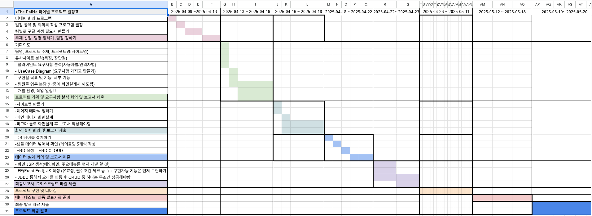
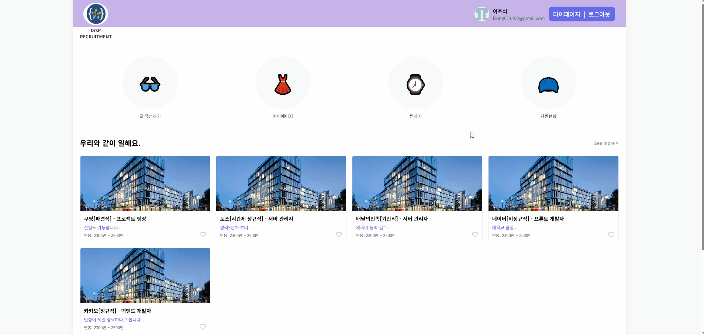
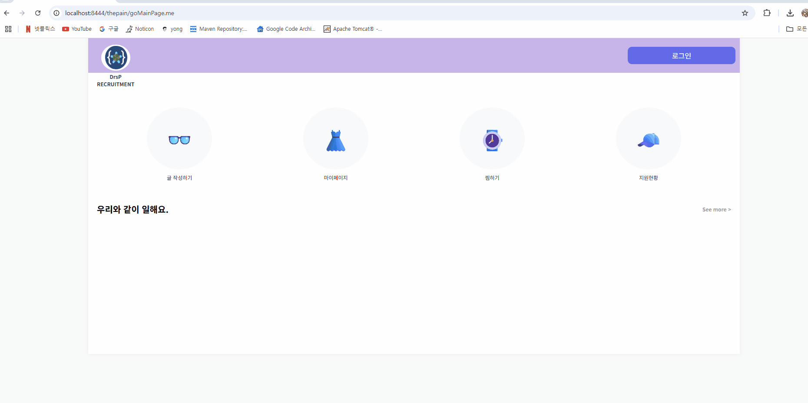
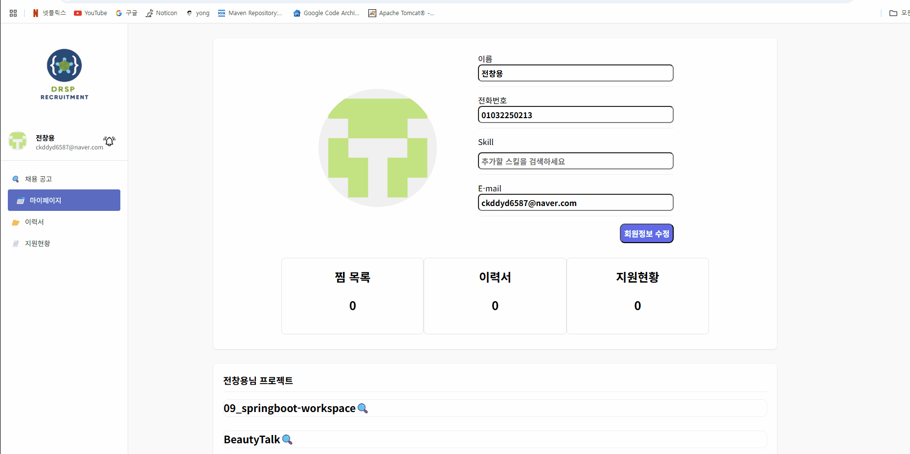

<!-- Heading -->

# 📘 프로젝트 소개

**개발자를 위한 통합 구인·구직 플랫폼을 구축하고자 합니다.**

현재 많은 개발자 중심 구인·구직 플랫폼이 존재하지만, 실제 사용자 입장에서 체감 되는 불편함은 여전히 많습니다.

먼저, 일부 플랫폼은 다양한 채용 공고가 올라오지만, 실제로 그 회사에서 얼마나 채용이 이루어졌는지에 대한 정보는 거의 제공되지 않습니다.

서류 탈락, 면접 불합격, 최종 합격과 같은 단계별 통계가 존재하지 않아 구직자는 자신이 어느 단계에서 어려움을 겪는지 파악하기 어렵고, 기업을 전략적으로 선택하는 데도 제한이 있습니다.

예를 들어, 어떤 기업이 지난 1년 동안 몇 명을 채용했는지, 채용 과정에서 어느 단계의 탈락률이 높은지 등의 정보를 확인할 수 있다면 실제 지원 시 큰 도움이 될 것입니다.

또한, 기존 플랫폼에서는 구직자의 역량을 판단하는 수단이 여전히 제한적입니다. 대부분의 경우 이력서, PDF 형식의 포트폴리오, 깃허브 주소 링크가 전부입니다.

하지만 이는 채용자가 지원자의 실제 개발 실력을 평가하기에 충분하지 않으며, 구직자의 코드 퀄리티나 기여도를 플랫폼 내에서 직관적으로 확인할 수 없는 구조는 신뢰를 형성하기 어렵게 만듭니다.

이러한 문제점을 해결하고자 본 프로젝트는 을 목표로 합니다.

  

# ⏱ 개발기간

  

# 🎈 구성원 및 역할

<h2 style="border-bottom: none">🧡 조장 : 이호석</h2>

- 알림 기능(웹소켓 기반)
- 찜하기 기능
- 검색 필터링

<h2 style="border-bottom: none">💙 조원 : 전창용</h2>

- GitHub API를 통한 로그인 기능
- GitHub API를 이용한 회원 정보 및 Public Repository, Readme 조회 (공동 개발)
- GitHub API를 통해 push로 Readme 수정
- 이력서 조회 및 Readme 파일을 통한 채용공고 지원
- 실시간 기술 검색 및 선택 기술 목록 관리

<h2 style="border-bottom: none">💙 조원 : 김준서</h2>

- GitHub API를 이용한 회원 정보 및 Public Repository, Readme 조회 (공동 개발)
- Gmail SMTP를 이용한 인증 메일 전송 및 인증 코드 검증, 일반 메일 전송
- 이력서 조회, 추가, 삭제
  
<h2 style="border-bottom: none">💙 조원 : 한재희</h2>
-  
-  
- 

  

# ⚙ 개발 환경
- OS : Windows 10/11  
- 개발 도구 : STS, VS Code, SQL Developer  
- 서버 : Apache Tomcat 9.0  
- DBMS : Oracle  
- Front-end : HTML5 / CSS3 / JavaScript / jQuery  
- Back-end : Java 11 / Spring Framework / MyBatis  
- ERD : ERD CLOUD  
- 협업 도구 : GitHub / Figma  / Gamma  /  Cloude  / Visily

  

# ✔ 설계
ERD Cloud :  
https://www.erdcloud.com/d/e66pxX4uJWB9aSEWS

  

# 📽 구현 기능

<h2 style="border-bottom: none">🤎 조원 : 이호석</h2>

### 🔍 검색 필터링

**기능 설명**  
사용자가 메인 페이지 상단의 **검색창**과 **고용형태/연봉 필터**를 활용해 채용 공고를 필터링할 수 있는 기능입니다.

- 입력된 키워드는 회사명, 직무 유형, 고용 형태, 연봉 범위와 비교되어 **해당 조건을 만족하는 채용 카드만 실시간으로 출력**됩니다.
- 필터링 조건은 중복 적용이 가능하며, 다수의 체크박스를 조합해 더욱 정교한 검색이 가능합니다.
- 기술적으로는 **JavaScript + jQuery** 기반으로 클라이언트 측에서 필터링되어, **DB 재요청 없이 빠른 반응 속도**를 보입니다.

---

### 🔔 알림 기능 (WebSocket 기반)

**기능 설명**  
총 4가지 주요 시나리오에 따라 실시간 알림이 발생하며, **WebSocket을 통해 즉시 사용자에게 전송**됩니다.

1. **지원 완료 알림**  
   - 지원자가 채용 공고에 지원서를 제출하면 발생  
   - 문구: `000님이 “네이버[정규직] - 프론트엔드 개발자” 공고에 지원하였습니다.`  
   - **모달창으로 실시간 표시**, 알림 내역은 DB에 저장됨  

2. **마감 임박 알림**  
   - 찜 또는 지원한 공고가 **마감 3일 전**인 경우 자동 전송  
   - 문구: `“카카오[정규직] - 백엔드 개발자” 공고 마감이 임박했습니다.`  
   - Spring Scheduler + SQL 시간 조건 기반 자동 발송  

3. **공고 마감 알림**  
   - 마감일이 지나면 해당 공고 상태를 '마감' 처리하고, 관련 사용자에게 알림  
   - 문구: `“토스[시간제 정규직]” 공고가 마감되었습니다. 다음 기회를 기대해 주세요.`  

4. **프로필 열람 알림**  
   - 기업 담당자가 구직자의 이력서를 열람했을 경우 발생  
   - 문구: `기업에서 귀하의 프로필을 확인했습니다.`  

**특징**  
- WebSocket 기반으로 **빠른 실시간 전송**
- **DB 저장 및 모달 출력**을 한 흐름에서 처리

---

### 💖 찜하기 기능

**기능 설명**  
구직자가 관심 있는 채용 공고를 **하트 아이콘 클릭으로 찜 등록**하거나 **삭제**할 수 있는 기능입니다.

- 찜 등록 시: 하트가 붉게 채워지고 DB에 해당 사용자와 공고 번호가 매핑되어 저장됨  
- 찜 해제 시: 다시 클릭하면 DB에서 삭제되고 하트는 회색으로 바뀜  
- AJAX 비동기 통신으로 페이지 새로고침 없이 상태 반영됨
- 마이페이지에서 찜한 공고들을 조회할 수 있으며, 찜 기반 알림과도 연동

---

  

<h2 style="border-bottom: none">💙 조원 : 전창용</h2>
<!-- 조원 구현 기능 기입 예정 -->

## ✨ 기능 설명

본 프로젝트는 **GitHub API 연동을 통한 소셜 로그인 및 레포지토리 관리**,  
그리고 **실시간 기술 검색 기반의 사용자 기술 스택 관리 기능**을 제공합니다.

---

### 🔐 GitHub API 연동을 통한 소셜 로그인 및 README 관리

**기능 구현**

- GitHub 소셜 로그인

- 로그인한 사용자의 GitHub 프로필, 레포지토리 목록, README 파일 등을 실시간으로 조회

- 선택한 저장소의 README.md 파일을 수정하고 Push를 통해 반영

---

### 🛠 실시간 기술 검색 및 기술 목록 관리

**기능 구현**

- 사용자가 입력하는 키워드에 맞춰 관련 기술을 **실시간으로 검색**
- 기술을 선택하여 **추가, 수정, 삭제** 가능
- 현재 사용자가 가지고 있는 기술(스킬) 목록을 조회 가능
- **한글/영어 모두 검색 가능** (예: `자바` → `Java`)
- 이미 추가된 기술은 `-` 아이콘 및 초록색 강조 표시  
- 새로 추가하는 기술은 `+` 아이콘으로 표시

  

<h2 style="border-bottom: none">💙 조원 : 김준서</h2>
<!-- 조원 구현 기능 기입 예정 -->

### GitHub API를 이용한 회원 정보 및 Public Repository, Readme 조회 

**기능 설명**

- GitHub API를 이용하여 GitHub에서의 기본정보 및 Repository에 대한 정보를 조회하여 화면에 출력하였습니다

- WebClient를 사용하여 API를 호출하여 사용하였습니다

#### GitHub 회원 마이페이지 - 해당 회원의 Public Repository 및 Readme 전체 조회

- GitHub 회원으로 로그인 시 Session에 저장해 놓은 Token을 사용해서 기본 정보 및 Repository 조회

#### 채용담당자 마이페이지 - 지원자 상세 조회 페이지 - 지원자의 Repository 링크 및 Readme 조회

- 토큰 없이 특정 회원의 GitHub 닉네임과 Repository 이름으로 조회

### Gmail SMTP를 이용한 인증 메일 및 일반 메일 전송

**기능 설명**

- 구글의 Gmail SMTP를 사용해서 이메일 전송 기능을 구현했습니다

#### JavaMailSender 사용을 위한 수동 Bean 등록

- 해당 프로젝트는 Spring Legacy Project인데 이 경우 JavaMailSender를 XML 또는 Java 파일로 Bean등록을 해주어야 합니다(Spring boot에서는 더 간단하게 가능)

#### 회원가입 인증 메일 전송 및 인증 코드 검증

**인증 메일**

- 인증 메일은 제목과 내용을 고정으로 설정하고 랜덤 코드와 수신자 메일을 받아서 이메일 전송

#### 채용담당자 마이페이지 - 지원자 상세 정보 페이지에서 일반 텍스트 메일 전송

<h2 style="border-bottom: none">💙 조원 : 한재희</h2>
<!-- 조원 구현 기능 기입 예정 -->

  

# 📚 최종 보고서 확인

<a href="./resources/assets/FinalProject_Report.pdf" download>📄 FinalProject_Report.pdf</a>
